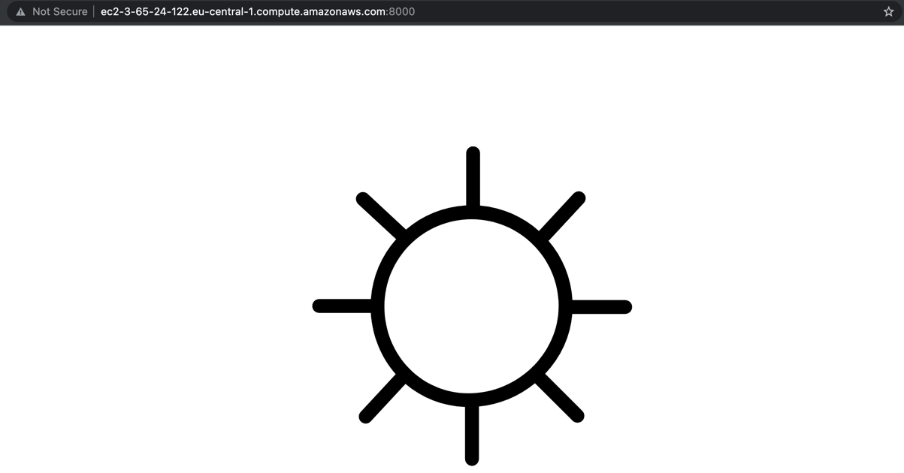

# Weatherapp
## Prerequisites

* An [openweathermap](http://openweathermap.org/) API key.
* [AWS](https://aws.amazon.com/free/) account, configured profile.
* Installed:
  * AWS CLI
  * docker
  * terraform
  * ansible
  * Node.js + NPM (if you want to run the app without docker)

## Configuration
The application is configured via environment variables.

Backed:
- APPID - API key for weather data

Frontend:
- ENDPOINT - base URL for the Backend app (e.g. `http://mydomain.com/api`)

## Running locally
### Without docker
You can run the app locally using `npm i && npm start` in both frontend and backend folders.
Don't forget to provide APPID env var.

### With Docker
**Dockerfile**s are located in the *frontend* and the *backend* directories to run them virtually on any environment having [docker](https://www.docker.com/) installed. 

* Go to *weatherapp* directory.
* Run `docker build -f backend/Dockerfile . -t backend` to build the backend image.
* Run the container by saying `docker run --rm -e APPID=<API_KEY> -p 9000:9000 --name backend -t backend`
* Run `docker build -f frontend/Dockerfile . -t frontend` to build the frontend image.
* Run the container by saying `docker run --rm -e ENDPOINT=http://0.0.0.0:9000/api -p 8000:8000 --name frontend -t frontend` (
  edit the ENDPOINT variable if you're running the backend on another address)

Now you have frontend and backend running locally (on 8000 and 9000 ports by default).

#### Docker Compose
These two images can be run in one action using **docker-compose.yml** file connecting images for the frontend and the backend. 

Command is `docker-compose up`.

Remember to have required environment variable defined. For example:
```
APPID=<API_KEY> ENDPOINT=http://0.0.0.0:9000/api docker-compose up
```

## Running in Cloud (AWS)
_Note:_ remember to have AWS account configured on your machine.

### Terraform
I decided to go with EC2 instance. It can be created with [terraform](https://www.terraform.io/) scripts.
* Go to `terraform/` folder
* Run `terraform init`
* Run `terraform apply`
* Follow the CLI instructions

You should have an EC2 instance now. 
Also, a key file `terraform/myKey.pem` should be created, you will need it later.

### AWS
Now you have your EC2 instance running. You can check it in AWS console or using AWS CLI. 

#### ECR
You have to create an ECR repository manually (_can probably be automated_), docker images can be pushed there.

* Go to Amazon ECR > Repositories > Create repository
* Create a private repository called `eficode`

The push commands can be seen in AWS (`View push commands` button) after creating your repository for the images.

For example:
```
docker tag backend:latest <YOUR_REGISTRY_URI>/eficode:backend
docker push <YOUR_REGISTRY_URI>/eficode:backend
```

Final result should look like this:


### Ansible

Using [ansible](https://docs.ansible.com/ansible/latest/index.html) playbook we can install docker, docker-compose and the app itself in the EC2.

Note, that the playbook is going to use `aws ecr get-login-password --region eu-central-1` to get an ECR authorization token. 

#### Change the key permission
**Warning**: I didn't have time to automate this, so this part has to be done manually:
* In `terraform/` folder run `chmod 400 myKey.pem`

#### Ansible config
You should have a `~/.ansible.cfg` file to make it possible to connect to EC2 instance.
Example:
```
[defaults]
host_key_checking = False
private_key_file=<PATH_TO_WEATHERAPP>/terraform/myKey.pem
inventory=/etc/ansible/hosts
remote_user = ubuntu

[ssh_connection]
control_path=%(directory)s/%%h-%%r
control_path_dir=~/.ansible/cp
scp_if_ssh = True
```

Use the key file created in the terraform step as `private_key_file`.

Next, you should have a `/etc/ansible/hosts` file with EC2 public DNS and key.
Example:
```
[ec2]

<YOUR_EC2_PUBLIC_DNS>.amazonaws.com ansible_ssh_private_key_file=<PATH_TO_WEATHERAPP>/terraform/myKey.pem
```

#### Running ansible playbook
**Warning**: I didn't have time to automate this, so this part has to be done manually:
* Edit `ansible/files/docker-compose-remote.yml`, replace images for backend and frontend with your ECR registry URI
* Edit `ansible/playbook.yaml`, `Pull app images` and `Login to ECR` steps: also use your ECR registry URI to pull images

Then
* Go to project's root
* To run the app on the remote host, execute:
```
ansible-playbook ansible/playbook.yaml --extra-vars "appid=<YOUR_API_KEY> endpoint=http://<EC2_PUBLIC_DNS>.amazonaws.com:9000/api"
```

Now you can check the running app by opening `http://<EC2_PUBLIC_DNS>.amazonaws.com:8000` in your browser. It might look like this:
